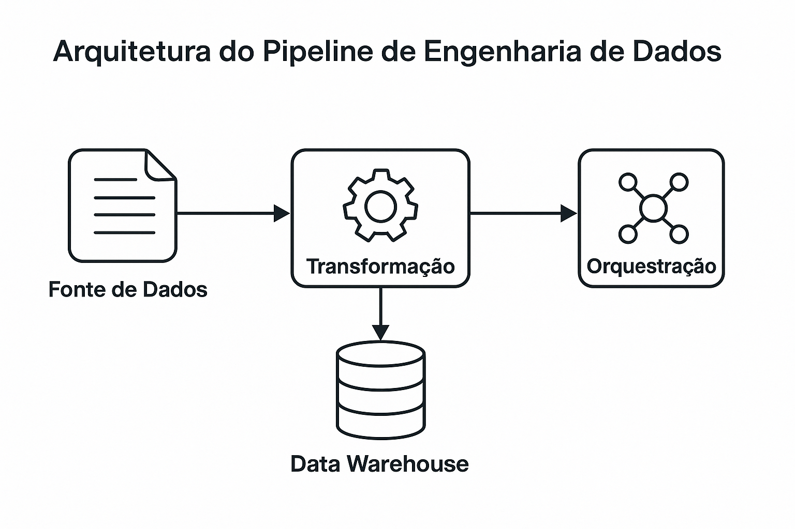

# Data Engineering Pipeline – Personal Project

This project simulates a complete data pipeline for extracting, transforming, orchestrating, and loading data into a modern data warehouse environment.

## 🚀 Tech Stack

- **Python** (pandas, requests, SQLAlchemy)
- **Apache Airflow** (DAG orchestration)
- **BigQuery** or **Redshift** (data warehouse)
- **Jupyter Notebook** (initial exploration)
- **GitHub Actions** (optional CI/CD)

## 📊 Pipeline Flow

1. Data extraction from a public API
2. Data transformation using Pandas
3. Storage in a data warehouse (BigQuery or Redshift)
4. Orchestration via Apache Airflow



## 📁 Project Structure

| Folder      | Description                             |
|-------------|-----------------------------------------|
| `src/`      | Python scripts for ETL (extract, transform, load) |
| `dags/`     | Apache Airflow DAG definitions          |
| `sql/`      | SQL queries (e.g., dimensional modeling)|
| `notebooks/`| Data exploration and validation         |
| `data/`     | Raw and processed CSV files             |
| `docs/`     | Diagrams and technical documentation    |

## ✅ Running the Project

1. Install dependencies:
```bash
pip install -r requirements.txt
