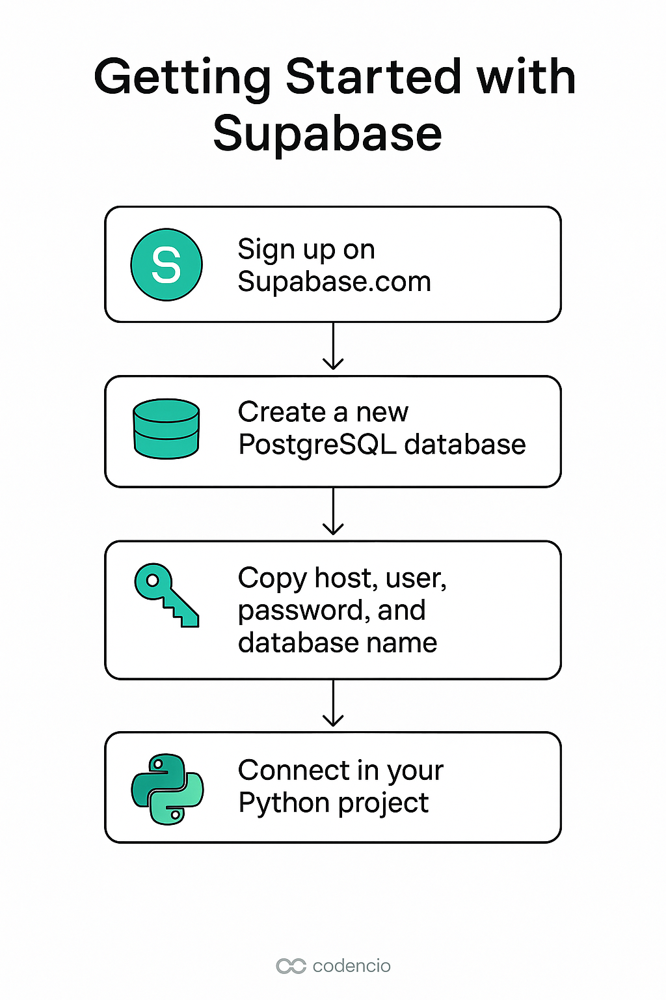

Vamos começar com o **Supabase** — a melhor opção gratuita e leve para ter um **PostgreSQL na nuvem** com conexão liberada, ideal para conectar ao **Mode** ou usar em seus projetos de dados.

---
Diagrama

---

## 🚀 Passo a passo: Criar e usar banco PostgreSQL com Supabase

### ✅ 1. Criar conta

Acesse: [https://app.supabase.com/](https://app.supabase.com/)

* Clique em **“Sign in with GitHub”** ou use email
* Após login, clique em **“New Project”**

---

### ✅ 2. Criar um novo projeto

Preencha os campos:

| Campo                 | Valor sugerido                   |
| --------------------- | -------------------------------- |
| **Project name**      | `data-pipeline`                  |
| **Database password** | algo forte (ex: `T@rcisio2025!`) |
| **Region**            | Pode manter a sugerida           |

⚠️ **Importante:** guarde a senha do banco! Você vai precisar para conectar ao Mode e ao Python.

---

### ✅ 3. Esperar o banco ser provisionado

Leva cerca de **1 minuto**.

---

### ✅ 4. Obter as credenciais de conexão

Vá até:

> **Project Settings → Database**

Copie os dados:

| Dado              | Onde usar               |
| ----------------- | ----------------------- |
| **Host**          | `db.<hash>.supabase.co` |
| **Port**          | `5432`                  |
| **Database name** | `postgres` (padrão)     |
| **User**          | `postgres` (padrão)     |
| **Password**      | a que você criou        |

---

### ✅ 5. Liberar acesso externo (caso necessário)

Se der erro de conexão no Mode, vá até:

> **Database → Connection Pooling → Toggle SSL**

E ative `require SSL`.

---

### ✅ 6. Conectar no Mode

Na tela “Connect a database” → **PostgreSQL**

Preencha com:

| Campo         | Valor (do Supabase)  |
| ------------- | -------------------- |
| Host          | `db.xxx.supabase.co` |
| Port          | `5432`               |
| Database Name | `postgres`           |
| Username      | `postgres`           |
| Password      | sua senha criada     |
| SSL           | **Yes**              |

Clique em **Connect** e pronto! 🚀

---

### ✅ 7. Inserir dados no Supabase

Você pode:

* Usar a aba **Table Editor** (interface visual no Supabase)
* Rodar um script Python para inserir dados (te ajudo no próximo passo)

---

Próximos passos que posso gerar pra você:

1. `.env` com as credenciais organizadas
2. Script Python de ETL com insert no Supabase
3. Conexão do Mode e criação de dashboard com seus dados

